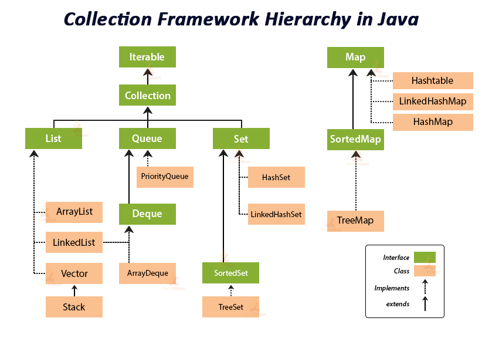

# Java
[java.util.Collections](https://docs.oracle.com/javase/8/docs/api/java/util/Collections.html)<br />


## 数组 Array

## 链表 List

## 哈希表 HashMap

## 栈 Stack
Java的栈操作最好用Deque来实现。
- [为什么不推荐使用Stack？](https://blog.csdn.net/qq_44013629/article/details/106461200)<br />
  因为Vector是当初JAVA曾经写得不太行的类，所以Stack也不太行。Vector不行是因为效率不太行，很多方法都用了synchronized修饰，虽然线程安全，但是像ArrayDeque,LinkedList这些线程不安全的，在需要安全的时候也可以用Collections.synchronizedCollection()转化成线程安全的，所以Vector就没什么用处了。
- [Why should I use Deque over Stack?](https://stackoverflow.com/questions/12524826/why-should-i-use-deque-over-stack)

## 队列 Queue / Deque
[link](https://www.geeksforgeeks.org/deque-interface-java-example/)
| Method               | Description                                                                                                                                                                                                                      |
|----------------------|----------------------------------------------------------------------------------------------------------------------------------------------------------------------------------------------------------------------------------|
| add(element)         | This method is used to add an element at the tail of the queue. If the Deque is capacity restricted and no space is left for insertion, it returns an IllegalStateException. The function returns true on successful insertion.  |
| addFirst(element)    | This method is used to add an element at the head of the queue. If the Deque is capacity restricted and no space is left for insertion, it returns an IllegalStateException. The function returns true on successful insertion.  |
| addLast(element)     | This method is used to add an element at the tail of the queue. If the Deque is capacity restricted and no space is left for insertion, it returns an IllegalStateException. The function returns true on successful insertion.  |
| contains()           | This method is used to check whether the queue contains the given object or not.                                                                                                                                                 |
| descendingIterator() | This method returns an iterator for the deque. The elements will be returned in order from last(tail) to first(head).                                                                                                            |
| element()            | This method is used to retrieve, but not remove, the head of the queue represented by this deque.                                                                                                                                |
| getFirst()           | This method is used to retrieve, but not remove, the first element of this deque.                                                                                                                                                |
| getLast()            | This method is used to retrieve, but not remove, the last element of this deque.                                                                                                                                                 |
| iterator()           | This method returns an iterator for the deque. The elements will be returned in order from first (head) to last (tail).                                                                                                          |
| offer(element)       | This method is used to add an element at the tail of the queue. This method is preferable to add() method since this method does not throws an exception when the capacity of the container is full since it returns false.      |
| offerFirst(element)  | This method is used to add an element at the head of the queue. This method is preferable to addFirst() method since this method does not throws an exception when the capacity of the container is full since it returns false. |
| offerLast(element)   | This method is used to add an element at the tail of the queue. This method is preferable to add() method since this method does not throws an exception when the capacity of the container is full since it returns false.      |
| peek()               | This method is used to retrieve the element at the head of the deque but doesn’t remove the element from the deque. This method returns null if the deque is empty.                                                              |
| peekFirst()          | This method is used to retrieve the element at the head of the deque but doesn’t remove the element from the deque. This method returns null if the deque is empty.                                                              |
| peekLast()           | This method is used to retrieve the element at the tail of the deque but doesn’t remove the element from the deque. This method returns null if the deque is empty.                                                              |
| poll()               | This method is used to retrieve and remove the element at the head of the deque. This method returns null if the deque is empty.                                                                                                 |
| pollFirst()          | This method is used to retrieve and remove the element at the head of the deque. This method returns null if the deque is empty.                                                                                                 |
| pollLast()           | This method is used to retrieve and remove the element at the tail of the deque. This method returns null if the deque is empty.                                                                                                 |
| pop()                | This method is used to remove an element from the head and return it.                                                                                                                                                            |
| push(element)        | This method is used to add an element at the head of the queue.                                                                                                                                                                  |
| removeFirst()        | This method is used to remove an element from the head of the queue.                                                                                                                                                             |
| removeLast()         | This method is used to remove an element from the tail of the queue.                                                                                                                                                             |
| size()               | This method is used to find and return the size of the deque.                                                                                                                                                                    |
```java
// Java program to demonstrate the
// removal of elements in deque
import java.util.*;
public class DequeExample {
    public static void main(String[] args)
    {
        Deque<String> deque = new LinkedList<String>();
  
        // We can add elements to the queue
        // in various ways
  
        // Add at the last
        deque.add("Element 1 (Tail)");
  
        // Add at the first
        deque.addFirst("Element 2 (Head)");
  
        // Add at the last
        deque.addLast("Element 3 (Tail)");
  
        // Add at the first
        deque.push("Element 4 (Head)");
  
        // Add at the last
        deque.offer("Element 5 (Tail)");
  
        // Add at the first
        deque.offerFirst("Element 6 (Head)");
  
        System.out.println(deque + "\n");
  
        // We can remove the first element
        // or the last element.
        deque.removeFirst();
        deque.removeLast();
        System.out.println("Deque after removing "
                           + "first and last: "
                           + deque);
    }
}
```
```java
// Java program to demonstrate the
// removal of elements in deque
  
import java.util.*;
public class ArrayDequeDemo {
    public static void main(String[] args)
    {
        // Initializing an deque
        Deque<String> dq
            = new ArrayDeque<String>();
  
        // add() method to insert
        dq.add("For");
        dq.addFirst("Geeks");
        dq.addLast("Geeks");
  
        System.out.println(dq);
  
        System.out.println(dq.pop());
  
        System.out.println(dq.poll());
  
        System.out.println(dq.pollFirst());
  
        System.out.println(dq.pollLast());
    }
}
```
```java
// Java program to demonstrate the
// iteration of elements in deque
  
import java.util.*;
public class ArrayDequeDemo {
    public static void main(String[] args)
    {
        // Initializing an deque
        Deque<String> dq
            = new ArrayDeque<String>();
  
        // add() method to insert
        dq.add("For");
        dq.addFirst("Geeks");
        dq.addLast("Geeks");
        dq.add("is so good");
  
        for (Iterator itr = dq.iterator();
             itr.hasNext();) {
            System.out.print(itr.next() + " ");
        }
  
        System.out.println();
  
        for (Iterator itr = dq.descendingIterator();
             itr.hasNext();) {
            System.out.print(itr.next() + " ");
        }
    }
}
```
## 堆 / 优先队列
## 字符串操作
## 类型转换